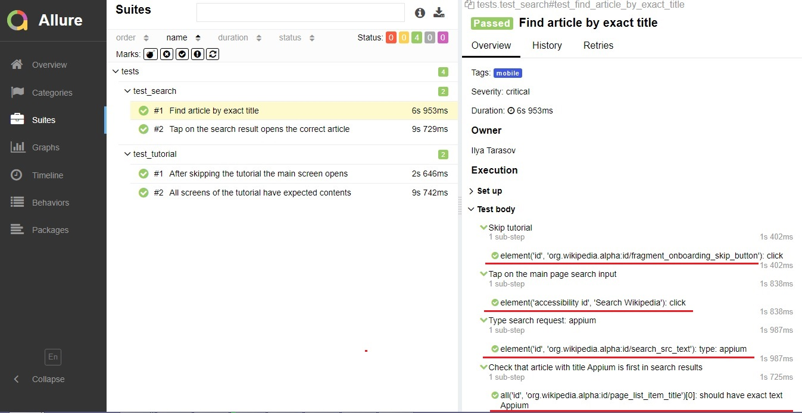

## QA.GURU: Дипломный проект (Mobile)

Проект содержит автотесты для мобильного приложения Wikipedia для Android.

### Используемые технологии

<p align="center">
  <code></code>
  <code></code>
  <code></code>
  <code></code>
  <code></code>
  <code></code>
  <code></code>
  <code></code>
  <code></code>
  <code></code>
  <code></code>
  <code></code>
</p>

Автотесты написаны на Python с использованием <code>Selene</code> и <code>Appium</code>. Тесты запускаются в <code>Jenkins</code>, отчёт о запуске формируется с помощью <code>Allure</code>, уведомление с отчётом приходит в <code>Telegram</code>.

### Тестируемая функциональность

Поиск:

- Поиск статьи по точному заголовку
- Открытие статьи из результатов поиска

Туториал:

- Пропуск туториала
- Проверка содержимого на всех слайдах туториала


## Запуск тестов

Тесты могут запускаться локально (на реальном устройстве и на эмуляторе) и удалённо - в облачной платформе для тестирования <a href="https://browserstack.com">BrowserStack</a>.

Способ запуска определяется переменной окружения **context**. Допустимые варианты её значений - **local_real**, **local_emulator** и **bstack**. Значение по умолчанию - **local_real**. В зависимости от значения context для конфигурации проекта (в файле <code>project.py</code>) будет выбран файл <code>.env.{context}</code>. Примеры заполнения конфигурационных файлов находятся в корневой директории проекта с расширением <code>.example</code>.

### Локальный запуск на реальном устройстве

Перед запуском необходимо:
- заполнить файл <code>.env.local_real</code>
- подключить устройство по USB
- запустить Appium Server
- находясь в корневой директории проекта, выполнить в консоли команды:

```
python -m venv .venv
source .venv/bin/activate
pip install -r requirements.txt
context=local_real pytest .
```

### Локальный запуск на эмуляторе

Перед запуском необходимо:
- заполнить файл <code>.env.local_emulator</code>
- запустить эмулятор через Android Studio AVD
- запустить Appium Server
- выполнить в консоли команды:

```
python -m venv .venv
source .venv/bin/activate
pip install -r requirements.txt
context=local_emulator pytest .
```

### Удалённый запуск на BrowserStack

Перед запуском необходимо:
- зарегистрироваться на сайте https://browserstack.com/
- на странице https://app-live.browserstack.com/ выбрать девайс и платформу для тестирования


- на странице https://app-automate.browserstack.com/dashboard/v2/builds/ скопировать username и access key


- заполнить файл <code>.env.bstack</code>
- выполнить в консоли команды:

```
python -m venv .venv
source .venv/bin/activate
pip install -r requirements.txt
context=bstack pytest .
```

При необходимости можно заменить .apk-файл в корне проекта на приложение Wikipedia другой версии. Файл из корня проекта будет автоматически загружен на BrowserStack. Если файл с таким именем был загружен ранее, повторно загружаться он не будет.

### Параметры запуска

Параметры запуска, заданные в .env-файлах, можно переопределить с помощью соответствующей переменной окружения, например:

```
context=bstack device='Galaxy S20' platform_version=10.0 pytest .
```

При запуске через Jenkins параметры можно передать на странице "Собрать с параметрами":


## Отчёт о прохождении тестов

После тестового прогона формируется тестовый Allure-отчёт.

### Локальный запуск

Для просмотра отчёта необходимо выполнить команду

```
allure serve allure-results
```

### Запуск в Jenkins

В разделе "Послесборочные операции" необходимо добавить шаг "Allure Report", указав директорию "allure-results":


Просмотреть сформированный отчёт, можно нажав на любую из ссылок "Allure Report" на странице сборки:


### Логирование низкоуровневых шагов

При выполнении тестов логируются локаторы элементов и действия, которые были над ними произведены:



### Аттачменты

После выполнения тестов в разделе "Tear down" прикрепляются скриншот экрана, XML-код и видео, если тест запускался на BrowserStack:


Пример видео:

https://github.com/ilyatara/wikipedia-app-tests/assets/135700131/7f349a2b-99d8-41d0-afcb-f3e06525037f


## Получение уведомления в Telegram

Для получения отчётов о прохождении тестов в Telegram необходимо добавить файл <code>notifications/telegram.json</code>. В нём нужно  заполнить поля "token" и "chat". Образец заполнения находится в <code>notifications/telegram.json.example</code>. Подробнее о заполнении файла см. <a href="https://github.com/qa-guru/knowledge-base/wiki/11.-%D0%A2%D0%B5%D0%BB%D0%B5%D0%B3%D1%80%D0%B0%D0%BC-%D0%B1%D0%BE%D1%82.-%D0%9E%D1%82%D0%BF%D1%80%D0%B0%D0%B2%D0%BB%D1%8F%D0%B5%D0%BC-%D1%83%D0%B2%D0%B5%D0%B4%D0%BE%D0%BC%D0%BB%D0%B5%D0%BD%D0%B8%D1%8F-%D0%BE-%D1%80%D0%B5%D0%B7%D1%83%D0%BB%D1%8C%D1%82%D0%B0%D1%82%D0%B0%D1%85-%D0%BF%D1%80%D0%BE%D1%85%D0%BE%D0%B6%D0%B4%D0%B5%D0%BD%D0%B8%D1%8F-%D1%82%D0%B5%D1%81%D1%82%D0%BE%D0%B2">инструкцию</a>.

### Удалённый запуск через Jenkins

В разделе "Послесборочные операции" после шага "Allure-report" нужно добавить шаг "Post build task":


Скрипт для отправки уведомлений:

```
java "-DconfigFile=notifications/telegram.json" -jar ".notifications/allure-notifications-4.5.0.jar"
```

### Локальный запуск

Для отправки уведомлений в Telegram после локального запуска выполните команды:

```
allure generate allure-results -o allure-report
java "-DconfigFile=./notifications/telegram.json" -jar "./notifications/allure-notifications-4.5.0.jar"
```

### Пример отчёта о выполнении тестов

В отчёте отображаются параметры запуска тестового комплекта, время прохождения тестов, а также ссылка на Allure-отчёт:


